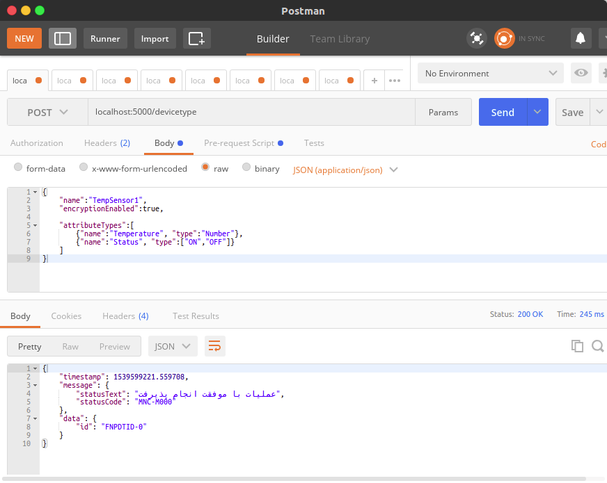
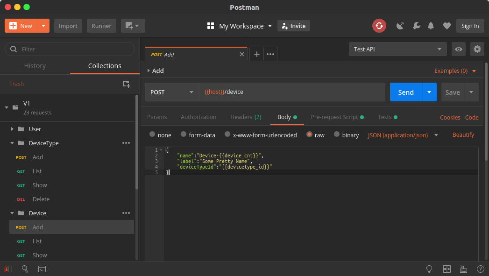

# Mock Rest Server

Python implementation of the [Fanap IOT Platform](http://doc.thingscloud.ir/v1.0.0.0/204/API).

## Requirements

- Python 3 (3.5 is tested)
- MQTT Broker (device data)

Optional

- MongoDB for device-data storage (version 4.0 is tested)
- Postman for evaluating rest-api (version 5.5 and 6.5.3 are tested)

## Installation (with virtualenv)

```bash
git clone PROJECT_REPOSITORY server

virtualenv env

# In Linux
source env/bin/activate

# In Windows
env\Scripts\activate.bat

cd server
pip install -r requirements.txt

# Set DB/MQTT parameters in run_server.py

python run_server.py

Creating default database!
 * Serving Flask app "app" (lazy loading)
 * Environment: production
   WARNING: Do not use the development server in a production environment.
   Use a production WSGI server instead.
 * Debug mode: on
 * Running on http://0.0.0.0:5000/ (Press CTRL+C to quit)
 * Restarting with stat
 * Debugger is active!
 * Debugger PIN: 324-763-485
 .....
```


## Usage

[Postman](https://www.getpostman.com/) can be used for evaluating the API.
`postman_export.json` can be used as an example workspace in postman.




